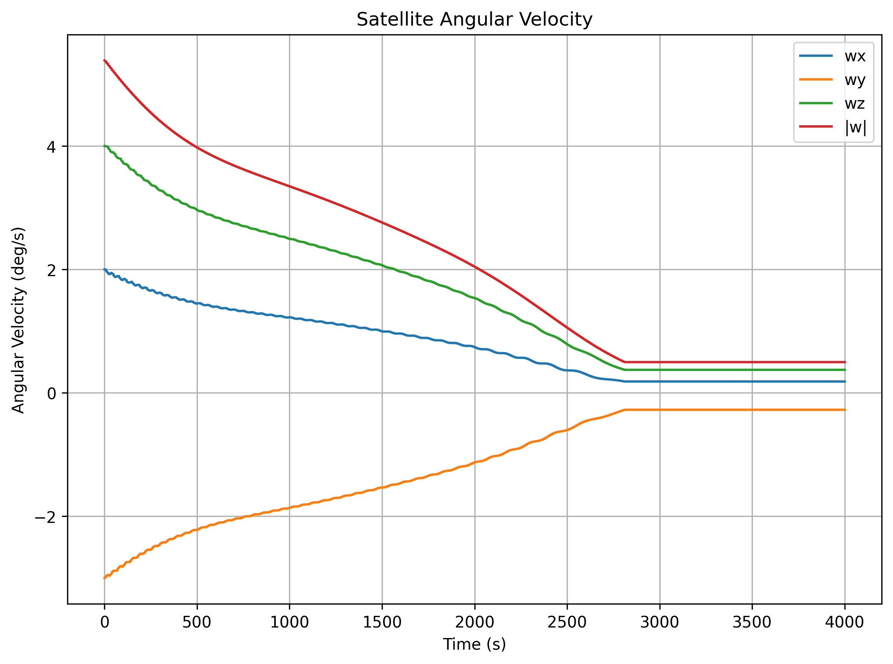
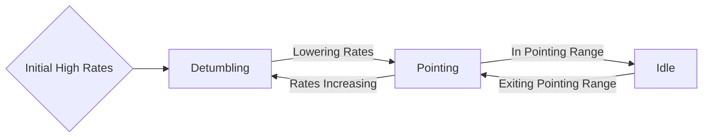

# Wprowadzenie

Poniższy kod wykonuje symulację ADCS (Attitude Determination and Control System) dla małego satelity (CubeSat).

Symulacja składa się z trzech głównych elementów:
 - Odtworzenie warunków orbitalnych i środowiskowych, w tym oporu atmosferycznego, pola magnetycznego oraz położenia Słońca.
 - Określenie orientacji i dynamiki satelity na podstawie pomiarów z czujników (magnetometr, czujnik Słońca) oraz algorytmów fuzji danych (TRIAD, QUEST, EKF).
 - Sterowanie satelitą w celu realizacji zadań detumblingu (wyhamowywania obrotów) i pointingu (ukierunkowania na Ziemię lub Słońce) przy użyciu cewek elektromagnetycznych.

# Przygotowanie

## Instalacja

Całość kodu stworzona jest w Pythonie i wykorzystuje dedykowane biblioteki zarówno do operacji matematycznych, jak i implementowania podstawowych modeli astronomicznych. Dalsza część zakłada posiadanie zainstalowanego Pythona (preferowany 3.13). Środowisko zarządzane jest przy pomocy Poetry. Zwięzłą instrukcję dotyczącą instalacji można znaleźć w ich [dokumentacji](https://python-poetry.org/docs/). Jednym z podstawowych elementów projektu Poetry jest plik [pyproject.toml](https://github.com/SethAlevy/ADCS/blob/main/pyproject.toml) znajdujący się w głównym folderze repozytorium. Definiuje on wymagane biblioteki oraz ich wersje. Co istotne, aby uzyskać pewność kompatybilności i działania, wersje bibliotek zostały zablokowane.

Aby zbudować środowisko należy wykonać następującą komendę:

```powershell
poetry install
```

Skorzystać ze środowiska można w różnoraki sposób.
- Wywołując poetry bezpośrednio (zalecane):

```powershell
poetry run python adcs.py
```

- Uruchamiając środowisko w terminalu:

```powershell
poetry env activate  # zwróci spersonalizowaną komendę do uruchomienia środowiska
# przykład aktywacji środowiska (PowerShell):
& "C:\sciezka\do\env\Scripts\Activate.ps1"
python adcs.py
deactivate
```

- Wybierając stworzone środowisko w edytorze kodu. Taki krok konieczny jest choćby w celu skorzystania z Jupyter Notebook.

## Struktura projektu

```text
ADCS/
├─ adcs.py
├─ mkdocs.yml
├─ pyproject.toml
├─ docs/
│  ├─ index.md
│  ├─ adcs.md
│  └─ adcs_pl.md
├─ core/
│  ├─ logger.py
│  ├─ state.py
│  ├─ transformations.py
│  └─ utilities.py
├─ spacecraft/
│  ├─ actuator.py
│  ├─ sensors.py
│  └─ satellite.py
├─ setup/
│  ├─ initial_settings.py
│  ├─ initial_settings.json
│  ├─ two_line_element.py
│  └─ tle
├─ templates/
│  ├─ actuator_template.py
│  ├─ sensor_template.py
│  ├─ satellite_template.py
│  ├─ two_line_element_template.py
│  └─ initial_settings_template.py
├─ visualizations/
│  └─ visualizations.py
└─ tests/
   ├─ conftest.py
   ├─ test_actuator.py
   ├─ test_sensors.py
   └─ test_transformations.py
```

Podstawą projektu jest folder **spacecraft**, gdzie umieszczone są podstawowe części kodu odpowiadające za systemy satelity.
- Skrypt [satellite.py](https://github.com/SethAlevy/ADCS/blob/main/spacecraft/satellite.py) odpowiada za generalne zarządzanie i sterowanie poszczególnymi elementami, spinając całość w jeden obiekt, przy pomocy którego można zarządzać najważniejszymi parametrami satelity.
- Skrypt [sensors.py](https://github.com/SethAlevy/ADCS/blob/main/spacecraft/sensors.py) odpowiada za całość kodu związanego z pomiarami, zarówno część symulującą środowisko do pomiaru, zaszumienie i przetwarzanie poszczególnymi algorytmi (TRIAD, QUEST, EKF).
- Skrypt [actuator.py](https://github.com/SethAlevy/ADCS/blob/main/spacecraft/actuator.py) odpowiada z kolei za elementy czynne (w tym wypadku jedynie cewki elektromagnetyczne). Jego rolą jest implementacja algorytmów kontroli (detumbling i pointing) oraz zarządzanie działaniem zgodnie ze spodziewanym efektem.

Folder **core** zawiera funkcje pomocne w pracy, głównie związane z operacjami matematycznymi czy szeroko pojętą orientacją przestrzenną i jej przetwarzaniem.
- Skrypt [logger.py](https://github.com/SethAlevy/ADCS/blob/main/core/logger.py) zawiera zdefiniowany moduł do wyświetlania logów.
- Skrypt [state.py](https://github.com/SethAlevy/ADCS/blob/main/core/state.py) odpowiada za zarządzanie wektorem stanu.
- Skrypt [transformations.py](https://github.com/SethAlevy/ADCS/blob/main/core/transformations.py) skupia się na funkcjach związanych z orientacją, takich jak przejścia między układami współrzędnych, operacje na kwaternionach i obroty.
- Skrypt [utilities.py](https://github.com/SethAlevy/ADCS/blob/main/core/utilities.py) zawiera wszelkie pozostałe przydatne funkcje, jak zmiana formatu daty, agregacja podstawowych funkcjonalności.

W folderze **setup** zebrane są informacje dotyczące ustawień symulacji, danych wejściowych oraz skrypty odpowiedzialne za ich przetwarzanie.
- Plik `tle` zgodnie z nazwą zawiera TLE (Two-Line Element Set) opisujący parametry orbitalne satelity.
- Skrypt [two_line_element.py](https://github.com/SethAlevy/ADCS/blob/main/setup/two_line_element.py) odpowiada za jego wczytywanie i intuicyjne przetwarzanie zawartych w nim parametrów.
- Plik [initial_settings.json](https://github.com/SethAlevy/ADCS/blob/main/setup/initial_settings.json) jest zbiorem parametrów i ustawień odpowiadających za stan początkowy, wartości stałych, parametry satelity czy wykorzystywane tryby. Z jego poziomu można zarządzać większością zmiennych mających wpływ na przebieg symulacji.
- Skrypt[initial_settings.py](https://github.com/SethAlevy/ADCS/blob/main/setup/initial_settings.py) odpowiada za wczytywanie i zarządzanie ustawieniami zawartymi w [initial_settings.json](https://github.com/SethAlevy/ADCS/blob/main/setup/initial_settings.json).

Folder **visualizations** związany jest z wizualizacjami pozwalającymi sprawdzić przebieg symulacji.
- Skrypt [visualizations.py](https://github.com/SethAlevy/ADCS/blob/main/visualizations/visualizations.py) zawiera kod odpowiedzialny za tworzenie wykresów.

W folderze **templates** zdefiniowane są pliki, które stanowią szkielet opisujący podstawową zawartość najważniejszych elementów repozytorium. Zawarte w nich parametry są niezbędnymi elementami właściwych skryptów.

## Pierwsze uruchomienie

Uruchomienie może odbyć się na dwa sposoby. Po zbudowaniu środowiska możliwe jest albo wykonanie skryptu adcs.py, który zawiera zintegrowaną symulację, lub uruchomienia jej w Jupyter Notebook. Kod wykona się dla domyślnych ustawień i powinien zwrócić normalne logi.

```
2025-11-14 23:42:20 | INFO | Simulation initialized with the following parameters:
2025-11-14 23:42:20 | INFO | Number of iterations: 10000
2025-11-14 23:42:20 | INFO | Satellite mass: 1.2 kg
2025-11-14 23:42:20 | INFO | Satellite inertia: [[0.002 0.    0.   ]
 [0.    0.002 0.   ]
 [0.    0.    0.002]] kg*m^2
2025-11-14 23:42:20 | INFO | Initial angular velocity: [ 2. -3.  4.] deg/s
2025-11-14 23:42:20 | INFO | Initial attitude (Euler angles): [0. 0. 0.] deg
2025-11-14 23:42:20 | INFO | Selected sensor fusion algorithm: EKF
2025-11-14 23:42:20 | INFO | Magnetometer noise: 10.0 nT
2025-11-14 23:42:20 | INFO | Sunsensor noise: 0.2 deg
2025-11-14 23:42:20 | INFO | Sensor on time: 2 seconds, actuator on time: 8 seconds

2025-11-14 23:42:20 | INFO | Iteration 0 of 10000
2025-11-14 23:42:25 | INFO | Iteration 100 of 10000
```

Taka forma oznacza, że kod działa poprawnie.

# Podstawy

Poniżej w skrócie przedstawione zostały najważniejsze zagadnienia teoretyczne wraz z przykładami zastosowania i odniesienia w kodzie symulacji. Jako że niektóre funkcje i metody zostały przygotowane konkretnie do działania w ramach repozytorium, ich poprawne funkcjonowanie wymaga inicjalizacji podstawowych obiektów i parametrów. Może to być wykonane poniższym fragmentem kodu (w większości przypadków ten fragment będzie umieszczony na początku):

```python linenums="1"
from pathlib import Path
from spacecraft.satellite import SatelliteImplementation
from setup.initial_settings import SimulationSetupReader
from setup.two_line_element import TwoLineElementReader
from spacecraft.sensors import MagnetometerImplementation, SunsensorImplementation, SensorFusionImplementation

setup = SimulationSetupReader(Path('setup/initial_settings.json'))
tle = TwoLineElementReader(Path('setup/tle'))
magnetometer = MagnetometerImplementation(setup)
sunsensor = SunsensorImplementation(setup)
sensor_fusion = SensorFusionImplementation(setup, ['triad', 'quest', 'ekf'], tr.euler_xyz_to_quaternion(setup.euler_angles))

satellite = SatelliteImplementation(setup, tle, magnetometer, sunsensor, sensor_fusion)
```

## Orbita i otoczenie

### Data juliańska (JD - Julian Date)

Data juliańska jest często wykorzystywaną formą przedstawienia czasu w obliczeniach i algorytmach astronomicznych. Jest to ułamek przedstawiający liczbę dni od 1 stycznia 4713 r. p.n.e. godziny 12. Na przykład dla daty w formacie `UTC 2025-10-18 00:00:00.000` JD wyniesie 2460966.5. Czasem spotkać można format Zmodyfikowanej Daty Juliańskiej (MJD - Modified Julian Date), która ma na celu uproszczenie przedstawionego ułamka i liczona jest jako:

```text
MJD = JD - 2400000.5
```

Dla powyższego przykładu będzie to 60966. W kodzie zastosowana jest standardowa JD, która wykorzystywana jest w bibliotece Skyfield. Wchodzi jako argument do modelu propagatora i pozwala uzyskać parametry orbitalne satelity. Za przekształcenie odpowiada funkcja, która zwraca aktualny czas satelity (czas początku symulacji plus liczba iteracji). Dla domyślnych ustawień biorących aktualny czas jako start będziemy mieli:

```python linenums="1"
import core.utilities as ut

time_satellite = satellite.setup.date_time
satellite_julian_date = ut.time_julian_date(satellite)

print(f"Satellite time: {time_satellite}")
print(f"Satellite Julian date: {satellite_julian_date}")
```

Powyższy kod zwróci:

```text
Satellite time: 2025-10-22 13:25:41.386584
Satellite Julian date: <Time tt=2460818.709556771>
```

Uwaga: Skyfield prezentuje czas w skali TT (Terrestrial Time). Różni się ona od UTC o ΔT (sekundy przestępne i dryf). Dla potrzeb IGRF wpływ jest pomijalny, ale dla precyzyjnych konwersji czasowych należy uwzględniać TT↔UTC.

### TLE

Najpopularniejszym formatem zapisu parametrów obiektów na orbitach okołoziemskich jest TLE (Two-Line Element Set), który zgodnie z nazwą składa się z dwóch linii, gdzie każda seria znaków ma swoje konkretne znaczenie. Przykładowy zapis umieszczony i wykorzystywany w tym repozytorium przedstawiono poniżej (można go również znaleźć pod ścieżką [ADCS/setup/tle](https://github.com/SethAlevy/ADCS/blob/main/setup/tle) ):

```
1 25544U 98067A 25143.20875603 .00008836 00000-0 16445-3 0 9994
2 25544 51.6382 70.8210 0002488 135.0606 10.4960 15.49676890511280
```

Aby prosto wczytywać i wyciągać dane z zapisu TLE stworzono odpowiadający za czytanie kod ( [two_line_element.py](https://github.com/SethAlevy/ADCS/blob/main/setup/two_line_element.py) ). Pozwala on zarówno wyciągać poszczególne elementy, znając ich nazwy, jak i podawać całe linie pliku w formie str. Znaczenie serii znaków zostało pokrótce dodane do opisów funkcji. Dobre podsumowanie i rozpiskę formatu można znaleźć na [Wikipedii](https://en.wikipedia.org/wiki/Two-line_element_set).

Wystarczy zainicjalizować TLE, aby móc z niego skorzystać:

```python linenums="1"
print(f'Two Line Element:\n{tle.line_1}\n{tle.line_2}')

print(f"Epoch Year: {tle.epoch_year}")
print(f"Epoch Day: {tle.epoch_day}")

print(f"Inclination: {tle.inclination}")
print(f"Bstar Drag: {tle.bstar_drag}")
```

Powyższy kod zwróci:

```text
Two Line Element:
1 25544U 98067A 25143.20875603 .00008836 00000-0 16445-3 0 9994
2 25544 51.6382 70.8210 0002488 135.0606 10.4960 15.49676890511280
Epoch Year: 25
Epoch Day: 143.20875603
Inclination: 51.6382
Bstar Drag: 16445-3
```

Warto zwrócić uwagę na format zapisu, Bstar Drag w TLE zapisane jako `16445-3` należy interpretować jako `0.16445e-3` (tj. `1.6445e-4`).

### Propagator

Propagator orbitalny wyznacza położenie satelity, jej prędkość i przyspieszenie w danym momencie. W tej symulacji użyto SGP4 (Simplified General Perturbations 4), który jest jednym z najczęsciej stosowanych. Korzysta z danych TLE i wymaga ich okresowej aktualizacji, aby ograniczyć narastanie błędów (w ramach symulacji wystarczy utrzymywać czas startu obliczeń w pobliżu daty generacji TLE). Implementacja pochodzi z biblioteki Skyfield.

```python linenums="1"
import skyfield.api as skyfield

satellite_model = skyfield.EarthSatellite(tle.line_1, tle.line_2)
julian_date = ut.time_julian_date(satellite)

position = satellite_model.at(julian_date).position.km
velocity = satellite_model.at(julian_date).velocity.km_per_s

print(f"Position vector: {position} [km]")
print(f"Velocity vector: {velocity} [km/s]")
```

Powyższy kod zwróci:

```text
Position vector: [-4107.48809952 -4489.58941621  3014.80595056] [km]
Velocity vector: [ 2.23875988 -5.3942253  -4.96501356] [km/s]
```

Położenie i prędkość są podstawowymi wynikami, ale możliwe jest też uzyskanie wysokości nad elipsoidą (WGS‑84), długości i szerokości geograficznej. Warto zauważyć, że wyniki Skyfield są w układzie GCRS (inercjalny, zgodny z ICRF przy J2000). „ECI” jest używane skrótowo jako nazwa zbiorcza. Jeśli wykorzystywany jest bezpośrednio SGP4/TEME, do ECEF/ITRF potrzebna jest transformacja (precesja, nutacja, czas gwiezdny).

Nieco więcej można znaleźć pod [linkiem](https://www.aero.iitb.ac.in/satelliteWiki/index.php/Orbit_Propagator)

### Niska orbita okołoziemska (LEO - Low Earth Orbit)

Część kosmosu, która rozciąga się od Ziemi aż do pasów Van Allena, określa się jako niską orbitę okołoziemską. W praktyce mówi się o pułapie od około 200 km do 2000 km. Jest ona szczególnie popularna ze względu na swoją bliskość i związany z tym niski koszt wynoszenia. Jest to jednak równocześnie problem ze względu na wciąż występujący opór atmosferycznego (szczególnie istotny dla pułapu do 300 km) oraz ograniczone pole widzenia. Z punktu widzenia układu określania orientacji i sterowania bliskość do Ziemi ma jeszcze jedną istotną zaletę, czyli stosunkowo silne pole magnetyczne, które może być wykorzystywane w czujnikach i elementach czynnych.

### Ziemskie pole magnetyczne

Ziemia wytwarza naturalnie pole magnetyczne wewnątrz i w swoim otoczeniu. Jego kształt w przybliżeniu odpowiada dipolowi lekko odchylonemu od osi obrotu. Składa się ze składowej stałej i zmiennej (ta druga to typowo 1-5%). Występują też lokalne anomalie. Dzięki obserwacjom opracowano dokładne modele, m.in. IGRF. W tej symulacji użyto biblioteki pyIGRF. Aby z niego skorzystać, potrzebne są współrzędne geograficzne oraz data w formie ułamka dziesiętnego (czas od początku roku przedstawiony jako ułamek, np. 2024.25 jako pierwszy kwartał danego roku).

```python linenums="1"
import pyIGRF
import core.utilities as ut
import datetime

lat = satellite.latitude
lon = satellite.longitude
alt_km = satellite.altitude
julian_date = ut.time_julian_date(satellite)

dt = julian_date.utc_datetime()
start = datetime.datetime(dt.year, 1, 1, tzinfo=dt.tzinfo)
end = datetime.datetime(dt.year + 1, 1, 1, tzinfo=dt.tzinfo)
decimal_year = dt.year + (dt - start).total_seconds() / (end - start).total_seconds()

# IGRF returns NED components in nT
d, i, h, b_n, b_e, b_d, f = pyIGRF.igrf_value(lat, lon, alt_km, decimal_year)

print(f"IGRF Magnetic Field NED: B_n={b_n:.2f}, B_e={b_e:.2f}, B_d={b_d:.2f} [nT]")
print(f"IGRF Magnetic Field Magnitude: F={f:.2f} [nT]")
print(f"IGRF Declination: D={d:.2f} [deg], Inclination: i={i:.2f} [deg], Horizontal Intensity: H={h:.2f} [nT]")
```

Powyższy kod zwróci:

```text
IGRF Magnetic Field NED: B_n=20470.13, B_e=-760.77, B_d=29507.77 [nT]
IGRF Magnetic Field Magnitude: F=35920.94 [nT]
IGRF Declination: D=-2.13 [deg], Inclination: i=55.23 [deg], Horizontal Intensity: H=20484.26 [nT]
```

Biblioteka domyślnie zwraca wektor i wypadkową wartość pola, deklinację, inklinację oraz intensywność horyzontalną. Z punktu widzenia ADCS istotny jest jedynie wektor. Warto zwrócić uwagę, że akurat pyIGRF zwraca go w formacie NED (North-East-Down) i przed dalszą pracą należy go poddać odpowiednim transformacjom (patrz rozdział o transformacjach).

Więcej informacji o modelu IGRF można znaleźć [tutaj](https://geomag.bgs.ac.uk/research/modelling/IGRF)

### Pozycja Słońca

Słońce i jego położenie to kolejny istotny element pomocny w określeniu orientacji w przestrzeni kosmicznej z racji jego dobrze przewidywalnego położenia względem Ziemi. Biorąc pod uwagę ogromną odległość, która dzieli oba ciała niebieskie, dla prostych obliczeń na niskiej orbicie można przyjąć opis z perspektywy planety, pomijając ruch orbitalny satelity. Dobry opis, jak obliczyć krok po kroku pozycję Słońca, można znaleźć ponownie na [Wikipedii](https://en.wikipedia.org/wiki/Position_of_the_Sun)

W tym przypadku użyto Skyfield do obliczenia wektora Słońca względem Ziemi dla zadanej daty juliańskiej.

```python linenums="1"
import skyfield.api as skyfield
import core.utilities as ut

# load ephemeris data for sun and earth
eph = skyfield.load('de421.bsp')
sun = eph['sun']
earth = eph['earth']

julian_date = ut.time_julian_date(satellite)

sun_position_eci = earth.at(julian_date).observe(sun).position.km

print(f"Sun Position ECI: {sun_position_eci} [km]")
```

Powyższy kod zwróci:

```text
Sun Position ECI: [7.11550861e+07 1.22678186e+08 5.31785009e+07] [km]
```

Zwrócony wektor Słońca jest w układzie ICRF (dla uproszczeń traktowany jako „ECI”).

## Orientacja i transformacje

### Układy odniesienia

Aby wyznaczyć orientację przestrzenną, należy najpierw ustalić układ współrzędnych. Ze względu na różnorodność obiektów i zastosowań w przestrzeni kosmicznej stosowany jest cały szereg różnych układów. Poniżej omówiono kilka, które przewijają się w tym repozytorium.

- **Układ Satelity (Satellite Body - SB)** - jest to układ na stałe związany ze statkiem kosmicznym, a więc poruszający i obracający się razem z nim po orbicie. W przypadku uproszczonej symulacji małego obiektu będzie on powiązany z czujnikami i to właśnie w nim podawane będą symulowane pomiary. W praktyce jednak definiuje się tzw. bazę nawigacyjną w pewnym punkcie satelity, a czasem czujniki mogą mieć własne układy odniesienia.

- **Ziemski układ inercjalny (Earth-Centered Inertial - ECI)** - układ związany z Ziemią, ale zablokowany względem gwiazd. Oś Z w kierunku bieguna północnego, oś X wzdłuż przecięcia równika i ekliptyki, oś Y dopełniająca. Początek w środku masy Ziemi. W praktyce często używa się GCRS (zgodny z ICRF).

- **Ziemski układ związany (Earth-Centered Earth-Fixed - ECEF)** - układ obracający się z Ziemią. Oś Z wzdłuż osi obrotu Ziemi, oś X to przecięciecie równika i południka 0°, oś Y równika i południka 90°E.

- **East-North-Up / North-East-Down (ENU / NED)** - są to dwie wariacje układu współrzędnych przydatnego do opisywania obiektów w okolicy Ziemi. Dwie peirwsze osie (X i Y) są zorientowane zgodnie z kierunkiem północnym lub wschodnim, a zasadniczą różnicą między nimi jest oś Z, która może być zwrócona w kierunku środka Ziemi lub przeciwnym (ENU: x=East, y=North, z=Up. NED: x=North, y=East, z=Down). Ten układ również może się pojawić w kontekście pola magnetyczego (modele IGRF zwracają wartości w tym układzie).

- **International Celestial Reference Frame (ICRF - International Celestial Reference Frame)** - inercjalny układ odniesienia z początkiem w barycentrum Układu Słonecznego; w praktyce używany do efemeryd. Dla orbit okołozimskich traktowany jako „ECI”.

- **Longitude / Latitude / Altitude (LLA - długość, szerokość, wysokość nad elipsoidą)** - forma geodezyjna względem WGS‑84 (model elipsoidy Ziemii).

### Przedstawienie orientacji i rotacji

W przypadku układu ADCS dla satelity na niskiej orbicie okołoziemskiej najważniejszymi układami będą ECI i SB, gdzie pierwszy jest punktem odniesienia, a drugi związany jest z pomiarami wykonywanymi na satelicie. Przejście między nimi będzie składało się z translacji (przesunięcia) i rotacji. Pierwszy z tych dwóch elementów zapewnia propagator, zwracając położenie satelity w danym momencie. Natomiast znalezienie odpowiedniej rotacji, która równocześnie będzie oznaczała orientację przestrzenną satelity, jest zadaniem układu ADCS osiąganym na podstawie wykonywania pomiarów czujnikami i porównywania ich z referencją. Przedstawienie orientacji i rotacji może odbyć się na kilka sposobów:

- **Kąty Eulera** - czyli trzy kolejne rotacje względem wybranych osi układu. Choć jest to dość intuicyjny sposób, chętnie wykorzystywany choćby w lotnictwie, posiada swoje ograniczenia czyniące go mniej użytecznym w kosmosie np. blokada przegubu (gimbal lock). W kodzie używane do inicjalizacji i wizualizacji.
- **Kwaternion** - q = [u_x sin(α/2), u_y sin(α/2), u_z sin(α/2), cos(α/2)]. Czteroelementowe przedstawienie rotacji, składające się z części wektorowej i skalarnej. Część wektorowa odpowiada osi obrotu u, a część skalarna to cos(α/2). Kwaternion jest zwięzłą, wygodną i stabilną numerycznie reprezentacją rotacji, pozbawioną wad kątów Eulera. 
- **Macierz rotacji** - najbardziej podstawowa forma przedstawienia to macierz, którą powinno się pomnożyć pierwotny wektor, aby otrzymać wektor docelowy.

Tematyka rotacji potrafi być podchwytliwa i generować błędy, aby zminimalizować ich ryzyko, do większości operacji wykorzystywana jest sprawdzona biblioteka scipy, która obsługuje wszystkie najważniejsze funkcje. Poniżej przedstawiono przykład obejmujący prostą rotację w formie kątów Eulera oraz kwaternionu przy pomocy wspomnianej biblioteki.

```python linenums="1"
import scipy.spatial.transform as R

euler_angles_init = [90.0, 0.0, 0.0]  # degrees
quaternion_init = [0.70710678, 0.0, 0.0, 0.70710678]  # [x, y, z, w]

reproduced_quaternion = R.Rotation.from_euler('xyz', euler_angles_init, degrees=True).as_quat()
reproduced_euler_angles = R.Rotation.from_quat(quaternion_init).as_euler('xyz', degrees=True)

print(f"Initial Euler Angles: {euler_angles_init} [deg]")
print(f"Initial Quaternion: {quaternion_init} [x, y, z, w]")
print(f"Reproduced Quaternion from Euler Angles: {reproduced_quaternion} [x, y, z, w]")
print(f"Reproduced Euler Angles from Quaternion: {reproduced_euler_angles} [deg]")

v1 = [0.0, 1.0, 0.0]

rotation = R.Rotation.from_quat(quaternion_init)
v2 = rotation.apply(v1)

print(f"Original Vector: {v1}")
print(f"Rotated Vector: {v2}")
```

Powyższy kod zwróci:

```text
Initial Euler Angles: [90.0, 0.0, 0.0] [deg]
Initial Quaternion: [0.70710678 0.         0.         0.70710678] [x, y, z, w]
Reproduced Quaternion from Euler Angles: [0.70710678 0.         0.         0.70710678] [x, y, z, w]
Reproduced Euler Angles from Quaternion: [90.  0.  0.] [deg]
Original Vector: [0.0, 1.0, 0.0]
Rotated Vector: [0. 0. 1.]
```

Uwaga: po każdej aktualizacji kwaternion powinien być normalizowany, aby ograniczyć dryf numeryczny.

W podobny sposób stworzono funkcje do przechodzenia pomiędzy układami współrzędnymi, które można znaleźć w [transformations.py](https://github.com/SethAlevy/ADCS/blob/main/core/transformations.py). Poniżej przedstawiono użycie pięciu podstawowych, zaimplementowanych przejść:

```python linenums="1"
import core.transformations as tr
import core.utilities as ut

v1 = [0.0, 1.0, 0.0]
julian_date = ut.time_julian_date(satellite)
quaternion_init = [0.70710678, 0.0, 0.0, 0.70710678]

enu_ecef = tr.enu_to_ecef(v1, satellite.latitude, satellite.longitude)
ned_ecef = tr.ned_to_ecef(v1, satellite.latitude, satellite.longitude)
ecef_eci = tr.ecef_to_eci(v1, julian_date)
eci_sb = tr.eci_to_sb(v1, quaternion_init)
sb_eci = tr.sb_to_eci(v1, quaternion_init)

print(f"Original Vector: {v1}")
print(f"ENU to ECEF: {enu_ecef}")
print(f"NED to ECEF: {ned_ecef}")
print(f"ECEF to ECI: {ecef_eci}")
print(f"ECI to SF: {eci_sb}")
print(f"SB to ECI: {sb_eci}")
```

Powyższy kod zwróci:

```text
Original Vector: [0.0, 1.0, 0.0]
ENU to ECEF: [ 0.02791803  0.44449952 -0.89534393]
NED to ECEF: [ 0.99961022 -0.01241439  0.02500598]
ECEF to ECI: [0.69189531 0.72199784 0.        ]
ECI to SB: [0. 0. 1.]
SB to ECI: [ 0.  0. -1.]
```

## Czujniki i elementy czynne

### Magnetometry

Magnetometr jest urządzeniem pozwalającym na pomiar pola magnetycznego. Istnieje wiele rodzajów magnetometrów o różnych możliwościach i rozmiarach w zależności od zastosowania i charakteru misji. W przypadku niewielkich satelitów na niskiej orbicie stosowane są magnetometry trzyosiowe. Często są to magnetometry działające w oparciu o nasycenie rdzenia magnetycznego (transduktorowe) lub działające na zasadzie magnetorezystancji. Dzięki postępującej miniaturyzacji są to zwykle niewielkie, lekkie układy o małym poborze mocy.

W przypadku tej symulacji magnetometr wybrany został jako główny czujnik. Symulacja magnetometrów opiera się o pole magnetyczne uzyskane przy pomocy modelu IGRF (International Geomagnetic Reference Field - IGRF). Aby uzyskać wartość będącą odpowiednikiem faktycznego pomiaru wykonanego przez przyrządy pokładowe, wektor musi zostać przekształcony do układu SB. Możliwe jest również dodanie szumu, w tym przypadku opartego o maksymalną bezwzględną odchyłkę.

```text
mag_field_sb += noise_vector
```

gdzie `noise_vector = <-x: +x>`.

Ustawienia dotyczące szumów można znaleźć w [initial_settings.json](https://github.com/SethAlevy/ADCS/blob/main/setup/initial_settings.json):

```json
"Magnetometer":
{
  "Noise": true,
  "AbsoluteNoise": 10,
  "UnitInfo": "nT"
},
```

Model szumu jest uproszczony (jednakowa, jednostajna odchyłka ±A na każdej osi). W rzeczywistych czujnikach częściej spotka się rozkład Gaussa + zakłocenia + dryf.

### Czujnik Słońca

Czujniki Słońca umożliwiają określenie tzw. wektora Słońca, czyli kierunku, w którym znajduje się Słońce względem satelity. W zależności od roli pomiaru w systemie mogą to być bardzo dokładne czujniki matrycowe lub nieco mniej dokładne, oparte o układy kilku fotodiod rozmieszczonych na zewnętrznych panelach. To właśnie ten drugi najczęściej spotkać można na małych satelitach. Dzięki swojej prostocie stanowią one bardzo dobre uzupełnienie dla pozostałych czujników. W tym przypadku traktowany jest on z reguły jako drugi czujnik.

Względne położenie Słońca uzyskiwane jest poprzez model obserwacji w bibliotece Skyfield (co opisano wcześniej), a następnie transformowane jest do układu SB. W ten sposób uzyskiwany jest odpowiedni wektor w formie, w jakiej byłby odczytany za pomocą czujników satelity. Następnie może on zostać zaszumiony. Szum czujnika Słońca realizowany jest jako obrót wektora wokół losowej osi o losowym kącie z zadanego zakresu.

```text
sun_vector = raw_sun_vector * R
```

gdzie R to macierz rotacji reprezentująca obrót o kąt z zakresu `<-x: +x>`.

Ustawienia dotyczące szumów znajdują się w [initial_settings.json](https://github.com/SethAlevy/ADCS/blob/main/setup/initial_settings.json):

```json
"SunSensor":
{
  "Noise": true,
  "AngularNoise": 0.2,
  "UnitInfo": "deg"
},
```

### Żyroskopy

Żyroskop to rodzaj czujnika, który mierzy prędkość kątową bezpośrednio. W klasycznym ujęciu jest to duże, wirujące urządzenie mechaniczne wykorzystujące zasadę zachowania momentu pędu. W praktyce misji kosmicznych zazwyczaj wykorzystuje się układy MEMS (Micro-Electromechanical Systems), czyli urządzenia oparte o niewielkie drgające elementy, które pozwalają zmierzyć prędkości obrotowe w oparciu o siłę Coriolisa. Są to niewielkie i tanie układy, jednak ich wadami są ograniczona dokładność i narastający z biegiem czasu dryf. W przypadku tej symulacji prędkość kątowa może być wyznaczana z różnicy orientacji między iteracjami: należy dzielić przez Δt i najlepiej użyć pochodnej kwaternionu `(ω = 2 q̇ ⊗ q⁻¹)`. Dryf nie jest szczegółowo modelowany.

```json
"Gyroscope" :
    {
        "Bias" : [0.02, -0.01, 0.015],
        "ProcessNoise" : [1e-5, 1e-5, 1e-5],
        "UnitInfo" : "deg/s"
    },
```

### Fuzja sensorów

Jednym z podstawowych problemów związanych z określaniem orientacji przestrzennej jest łączenie pomiarów z dwóch i więcej źródeł w taki sposób, aby uzyskać jedną, bardziej niezawodną i dokładniejszą estymatę. Wykorzystanie kilku rodzajów czujników pozwala na zbilansowanie potencjalnych problemów w sytuacjach, gdzie jeden poradziłby sobie gorzej. Aby uzyskać sprawnie przetworzony pomiar, tworzone są specjalne algorytmy. W przypadku misji kosmicznych często wyróżnia się trzy:

- **TRIAD (Three-Axis Attitude Determination)** - jest najbardziej podstawowym i najprostszym z nich. Umożliwia przetworzenie pomiarów jedynie z dwóch czujników, znając wektory w układzie satelity i ich odpowiedniki w układzie odniesienia. Odnajdywanie macierzy rotacji między nimi odbywa się poprzez tworzenie tzw. triad (układy odniesienia bazujące na danych wektorach) i wzajemnego położenia między nimi.

- **QUEST (QUaternion ESTimator)** - jest algorytmem odnajdywania rotacji dla serii wektorów (QUEST może przetworzyć dwa czujniki i więcej, w odróżnieniu od TRIAD-a) poprzez minimalizację funkcji błędu (problem Wahby). Wynikiem jego działania jest bezpośrednio kwaternion przedstawiający rotację, który odpowiada wektorowi własnemu (eigenvector) macierzy skonstruowanej z danych pomiarowych. Opcjonalnie pomiary mogą być zaopatrzone w wagi, definiując najbardziej dokładne z nich.

- **EKF (Extended Kalman Filter)** - jest bardziej zaawansowanym algorytmem estymacji stanu dla równań nieliniowych. Opiera się na działaniu iteracyjnym, z jednej strony wykorzystując model dynamiki obiektu, aby przewidywać jego przyszły stan, z drugiej korzysta z pomiarów czujników do jego korekcji. W przypadku układu ADCS będzie więc wykorzystywał nie tylko pary wektorów pomiarów, ale również prędkość kątową oraz poprzednią orientację. Estymaty wyliczane przy pomocy EKF powinny być zauważalnie dokładniejsze od TRIAD-a i QUEST-a. Poniżej przedstawiono przykład wykorzystania algorytmów do uzyskania kwaternionu dla układu dwóch wektorów obróconych o 90 stopni przy zerowej prędkości kątowej.

```python linenums="1"
import numpy as np

# two reference vectors
v1_i = np.array([1.0, 0.0, 0.0])
v2_i = np.array([0.70710678, 0.70710678, 0.0])

# two measured vectors with some noise rotated by 90 deg around z axis
v1_b = np.array([0.0, 1.0, 0.0]) + np.random.uniform(-0.02, 0.02, size=3)
v2_b = np.array([-0.70710678, 0.70710678, 0.0]) + np.random.uniform(-0.05, 0.05, size=3)

q_reference = np.array([0.0, 0.0, 0.70710678, 0.70710678])

# typically the first vector should be the most accurate one
v_i_list = [v1_i, v2_i]
v_b_list = [v1_b, v2_b]

# normalize before estimation (TRIAD/QUEST/EKF)
v_i_list = [v/np.linalg.norm(v) for v in v_i_list]
v_b_list = [v/np.linalg.norm(v) for v in v_b_list]

q_triad = sensor_fusion.triad(v_b_list, v_i_list)
q_quest = sensor_fusion.quest(v_b_list, v_i_list)
q_ekf = sensor_fusion.ekf(v_b_list, v_i_list, np.array([0.0, 0.0, 0.0, 0.0]), 1, q_reference)

# signs may differ between algorithms, but represent the same rotation q = -q
print(f"Reference quaternion: {q_reference} [x, y, z, w]")
print(f"TRIAD Quaternion: {q_triad} [x, y, z, w]")
print(f"QUEST Quaternion: {q_quest} [x, y, z, w]")
print(f"EKF Quaternion: {q_ekf} [x, y, z, w]")
```

Powyższy kod zwróci:

```text
Reference quaternion: [0.         0.         0.70710678 0.70710678] [x, y, z, w]
TRIAD Quaternion: [-0.01693025 -0.01254686  0.7105929   0.70328776] [x, y, z, w]
QUEST Quaternion: [-0.01691007 -0.01257405  0.70946175  0.70442883] [x, y, z, w]
EKF Quaternion: [-0.00855144 -0.00616122  0.70900606  0.70512362] [x, y, z, w]
```

Widać, że estymata zapewniona przez QUEST jest nieco lepsza niż TRIAD, jednak to EKF najbliższy jest wartości prawdziwej (wynik będzie różnił się przy każdym uruchomieniu ze względu na losowe szumy). Wybór algorytmu do fuzji sensorów oraz parametry jego uruchomienia ustalane są z poziomu [initial_settings.json](https://github.com/SethAlevy/ADCS/blob/main/setup/initial_settings.json) (jedynie TRIAD nie posiada dodatkowych parametrów).

### Cewki elektromagnetyczne

Tak jak rolą sensorów jest zapewnienie niezawodnej informacji o dynamice i orientacji satelity, tak rolą elementów czynnych jest wykorzystanie tej informacji w celu zapewnienia sterowania zgodnie z ustalonym profilem. Cewki elektromagnetyczne są podstawowym elementem sterowania dla małych satelitów na niskich orbitach okołoziemskich. Najczęściej występują w formie trzyosiowego układu cewek na rdzeniu magnetycznym lub na rdzeniu powietrznym. Ta druga forma jest często stosowana ze względu na lepszą możliwość wpasowania w konstrukcję satelity i taki układ założono w projekcie.

Podstawą działania jest generowanie przez cewkę, przez którą płynie prąd, momentu magnetycznego. Oddziałując z ziemskim polem magnetycznym, będzie on generował moment obrotowy zgodnie ze wzorem:

```text
τ = m × B
```

Jednostki: `m [A·m²], B [T], τ [N·m]`. 

Sterowanie jest ograniczone lokalnie słabym polem oraz geometrią: gdy wymagany moment jest równoległy do `B, m × B ≈ 0` i sterowanie staje się nieefektywne.

Parametry cewki zastosowanej w projekcie można znaleźć w [initial_settings.json](https://github.com/SethAlevy/ADCS/blob/main/setup/initial_settings.json):

```json
"Magnetorquer": {
  "Coils": 200,
  "MaxCurrent": 0.2,
  "CoilArea": 90,
  "SafetyFactor": 0.9,
  "AlphaCap": 0.5,
  "UnitInfo": "coils, cm^2, A, unitless, deg/s2"
}
```

Uwaga: CoilArea jest w cm² i w obliczeniach przeliczana na m² (×1e‑4).

# Symulacja

Powyższe elementy składowe tworzą model, który umożliwia symulowanie niewielkiego satelity na orbitach okołoziemskich. Poniżej przedstawiono omówienie zarządzania wejściem, algorytmami i parametrami satelity.

## Ustawienia wejściowe

W celu ułatwienia zarządzania wszelkimi parametrami mającymi wpływ na przebieg symulacji zostały one umieszczone w pliku json, a do jego zarządzania stworzony został kod [initial_settings.py](https://github.com/SethAlevy/ADCS/blob/main/setup/initial_settings.py). Dzięki temu możliwe jest zarządzanie każdym etapem bez potrzeby zbędnego wchodzenia w odpowiadający mu kod. Możliwe jest też tworzenie kilku wariantów uruchomienia, jako że plik json podawany jest jako parametr wejściowy w formie ścieżki, a nie jest zapisany na sztywno. Całość pogrupowana jest w strukturze przypominającej słownik w Pythonie z pięcioma kluczami na głównym poziomie i kolejnymi bardziej szczegółowymi. Do tego dodany jest wpis z jednostkami parametrów, nie jest on nigdzie wczytywany i ma charakter informacyjny.

- **Simulation** - zawiera podstawowe parametry dotyczące samej symulacji, takie jak stałe fizyczne, zarządzanie krokami symulacji czy datę początku obliczeń.

- **Satellite** - zawiera wszelkie parametry opisujące bezpośrednio satelitę, jak masa, inercja i początkową orientację.

- **Sensors** - zawiera wszelkie istotne parametry związane z sensorami i wykonywaniem pomiarów. Będą więc to nastawy samych czujników, ale też parametry algorytmu fuzji sensorów.

- **Actuators** - zawiera parametry dotyczące elementów czynnych, w tym wypadku będą to jedynie parametry cewki elektromagnetycznej, takie jak liczba zwojów, pole przekroju, współczynnik bezpieczeństwa, ograniczenie przyspieszenia.

- **Controls** - zawiera wszelkie parametry związane ze sterowaniem satelitą, takie jak wybór algorytmu fuzji sensorów, ustawienia i parametry związane z algorytmami detumblingu i pointingu czy przełączania trybów.

Skrypt [initial_settings.py](https://github.com/SethAlevy/ADCS/blob/main/setup/initial_settings.py) przygotowany jest do sprawnego działania z aktualnie zastaną strukturą wpisów. Brak któregokolwiek z wymaganych kluczy spowoduje pojawienie się błędu, jednak możliwe jest dodanie dodatkowych wpisów. Jeśli takowy pojawi się na najniższym poziomie, po prostu zostanie dodany do wczytanej struktury. Dodanie jednostki jest opcjonalne. Na przykład:

```json
"Magnetorquer":
{
  "Coils": 200,
  "MaxCurrent": 0.2,
  "CoilArea": 90,
  "SafetyFactor": 0.9,
  "AlphaCap": 0.5,
  "WireDia": 0.8,
  "UnitInfo": "coils, cm^2, A, unitless, deg/s2, mm"
}
```

Wtedy w zdefiniowanym w skrycie słowniku pojawi się on jako klucz:

```python linenums="1"
setup.magnetorquer_params["WireDia"]
```

Natomiast jeśli dodany zostanie wpis w jakimkolwiek innym miejscu, trafi on do "pozostałych" parametrów zapisanych w `self.other_parameters`:

```json
{
  "Simulation": { "PlanetConst": ... },
  "SomeOtherData": {
    "A": 2,
    "B": 4
  }
}
```

Wtedy całość zostanie wczytana w dokładnie takiej samej formie:

```python linenums="1"
data_dict = setup.other_parameters["SomeOtherData"]
A = data_dict["A"]
B = data_dict["B"]
```

## Parametry satelity

Aby ułatwić przeprowadzanie operacji związanych z satelitą, traktowany jest on jako obiekt składający się z pewnych komponentów, a opisujące go najważniejsze parametry zostały określone jako property w ramach [satellite.py](https://github.com/SethAlevy/ADCS/blob/main/spacecraft/satellite.py). Warto zwrócić uwagę na samą inicjalizację:

```python linenums="1"
satellite = SatelliteImplementation(setup, tle, magnetometer, sunsensor, sensor_fusion)
```

A więc elementami składowymi wpływającymi na stan satelity są dane wejściowe, TLE, dwa czujniki: magnetometr i czujnik słońca oraz algorytm fuzji. Możliwe jest proste dostanie się zarówno do stałych parametrów, jak i na bieżąco aktualizowanych tych, które określają aktualny stan. Dzięki ich wcześniejszemu zdefiniowaniu pojawiają się one zawsze jako "podpowiedzi" w edytorze oraz możliwe jest szybkie wyświetlenie ich opisu. Przykładowe parametry przedstwiono poniżej:

```python linenums="1"
print(satellite.angular_velocity)
print(satellite.inertia_matrix)
print(satellite.magnetic_field)
print(satellite.torque)
```

Powyższy kod zwróci:

```text
[  8. -14.  11.]
[[0.002 0.    0.   ]
 [0.    0.002 0.   ]
 [0.    0.    0.002]] (array([-12117.938582  , -12371.50694404, -31464.45657624]), array([-12121.11401262, -12375.32291477, -31468.13563725]))
[0. 0. 0.]
```

## Algorytmy sterowania

Podstawą zachowania satelity na orbicie są zaimplementowane algorytmy sterowania. Ich definicja związana jest z charakterem misji, dostępnymi czujnikami czy elementami czynnymi. Podstawowe trzy stany, z jakimi można spotkać się w przypadku satelitów, to detumbling (wyhamowywanie obrotów), pointing (skierowanie na cel) oraz stan wyłączony. Przejścia między nimi zdefiniowane są przez osiągnięcie pewnych kryteriów i znaleźć je można w [initial_settings.json](https://github.com/SethAlevy/ADCS/blob/main/setup/initial_settings.json).

### Detumbling (wytracanie obrotów, B-dot)

Wyhamowywanie prędkości obrotowej jest z reguły pierwszym i najważniejszym zadaniem dla układu sterowania. Wypuszczony na orbitę satelita najczęściej trafia na orbitę, obracając się stosunkowo szybko i niekontrolowanie. Aby przejść do poprawnego wykonywania misji, należy jego pozycję przestrzenną ustabilizować poprzez spowolnienie do pewnej wartości granicznej prędkości. Doprowadzenie i utrzymanie odpowiednio niskich obrotów to zadanie detumblingu. Dla założonego w projekcie wykorzystania do sterowania jedynie cewki elektromagnetycznej realizowane będzie to algorytmem zwanym B-dot. Jego nazwa i zasada działania odnoszą się do pochodnej pola magnetycznego. Szybkość zmiany zmierzonego pola magnetycznego będzie proporcjonalna do prędkości kątowej na każdej osi. W praktyce generowany moment magnetyczny musi oddziaływać o przeciwnym zwrocie i zostać odpowiednio powiększony o współczynnik wzmocnienia.

```text
m = -k * dB/dt
```

Istnieje kilka modyfikacji podstawowego algorytmu, które mogą okazać się przydatne w pewnych sytuacjach i zastosowaniach. Dla przykładowego satelity 1U nie będą to jednak różnice wielkie. Poniżej krótko omówione zostały pozostałe warianty:

- **Zmodyfikowany B-dot** - jego działanie nie bazuje na pochodnej pola magnetycznego, a bezpośrednio na pomiarach prędkości obrotowej. Jego działanie będzie więc mniej podatne na zakłócenia samego pola magnetycznego, ale wymaga odpowiedniego źródła pomiarów prędkości kątowej.

```text
m = -k (ω × B)
```

- **Proporcjonalny B-dot** - do standardowego algorytmu dodany człon tłumiący również oparty o prędkość obrotową. Może mieć wpływ stabilizujący w obliczu zmian pola magnetycznego, ale jeśli będzie zbyt mocny, sam będzie powodował oscylacje lub nawet destabilizował kontroler przy małych prędkościach obrotowych.

```text
m = -k * dB/dt - k_p * ω
```

- **Adaptujący prędkość obrotową** - sama zasada działania nie różni się od podstawowego wariantu, jednak wzmocnienie jest zależne od aktualnej prędkości obrotowej względem pewnej ustalonej wartości granicznej. Powyżej będzie ono odpowiednio powiększone, a poniżej zmniejszone. Taki wariant przyspiesza początkowe wytracanie prędkości, za to mocno łagodzi działania kontrolera na późniejszym etapie, może jednak utrudniać tłumienie przy bardzo małych prędkościach.

```text
k = k * (|ω|/ω_ref)^a
```

- **Adaptujący pole magnetyczne** - również nie wpływa na sam algorytm, a jedynie modyfikuje wzmocnienie. Jest ono zależne od wartości bezwzględnej pola magnetycznego w stosunku do pewnej wartości granicznej (często przyjmowanej w okolicy średniej pola magnetycznego Ziemi ~45000 nT). Pomaga w ten sposób niwelować wpływ zmian pola wraz z ruchem po orbicie, zwiększając wzmocnienie, gdy te maleje, oraz zmniejszając, gdy jego wartość rośnie.

```text
k = k * (B_ref/|B|)^b
```

Co istotne, powyższe warianty mogą się ze sobą łączyć. W większości przypadków jednak podstawowy B-dot będzie wystarczający. Algorytm jest bardzo prosty i niezawodny w swoim działaniu, dla niewielkiego satelity powinien sprawnie zbijać nawet bardzo duże prędkości, a czas jego działania powinien mieścić się od niecałej godziny do maksymalnie kilku (czasu symulacji) w zależności od warunków początkowych. Wynikowy wykres prędkości obrotowej w czasie powinien gładko zbiegać do 0 o kształcie przypominającym funkcję 1/x. Przykładowy wykres przedstawiono poniżej.



Jeśli obserwowane są oscylacje, zmiany kierunku prędkości czy niestabilności, należy upewnić się co do wybranych parametrów.

-** Wzmocnienie** - podstawowy parametr oddziałający, który odpowiada za przekucie pochodnej na odpowiednio duży moment magnetyczny, który może być obsłużony przez cewki. Dla przykładowego satelity 1U wartości między 1000 a 4000 powinny być wystarczające, dla większych również wzmocnienie można odpowiednio zwiększać. Ważnym parametrem, który należy obserwować podczas doboru wzmocnienia, jest obciążenie cewek, jeśli przez długi czas osiąga ono wartości maksymalne, wzmocnienie należy zmniejszyć. Analogicznie w drugą stronę, gdy przez długi czas jest ono bardzo niskie, można je zwiększyć. Pomocniczym parametrem może też być sam spadek prędkości obrotowej - zbyt powolny może sugerować za małe wzmocnienie, wyraźne niestabilności zbyt duże.

- **Współczynnik proporcjonalny** - pełni raczej rolę pomocniczą, stąd jego wartość też powinna być odpowiednio mała. Uwzględniając, że łączony jest on bezpośrednio z prędkością kątową w radianach, można przyjmować wartości między 0.05 a 0.6. Zbyt mały nie będzie powodował zauważalnego efektu, zbyt duże generował niestabilności.

Oprócz tego należy zwrócić uwagę na parametry satelity takie, jak masa i macierz inercji, oraz same parametry cewki elektromagnetycznej. Elementy te, choć nie pojawiają się w samym algorytmie, są kluczowym elementem przetworzenia momentu magnetycznego na moment obrotowy.

### Pointing (B-cross)
**UWAGA: Element ten wciąż jest w trakcie tworzenia i nie zachowuje się stabilnie, a sam kod nie ma ostatecznej formy.**

Nakierowanie satelity konkretną stroną w kierunku jakiegoś celu jest jedną z podstawowych funkcji, która może być realizowana w związku z misją. Dla obiektów na orbitach okołoziemskich najczęściej będzie to obrót w kierunku Ziemi (np. nakierowanie kamery) lub w kierunku Słońca (np. optymalne ustawienie paneli słonecznych). Jednym z algorytmów, który można zastosować, wykorzystując cewki elektromagnetyczne, jest B-cross. Opiera się on na zastosowaniu mnożenia wektorowego (cross product) do minimalizacji kąta między dwoma danymi wektorami (cel i aktualne ułożenie). W swojej podstawowej wersji algorytm ma postać członu nakierowującego oraz tłumiącego:

```text
m = m_align + m_damp = k_a (error_vector × B) + k_d (ω × B)
```

Często stosuje się go w wersji znormalizowanej względem pola magnetycznego w celu poprawy stabilności. Zmiana będzie też przejawiać się w rzędach wielkości współczynników wzmocnienia. Wtedy algorytm przybiera postać:

```text
m = m_align + m_damp = k_a (error_vector × B)/||B||^2 + k_d (ω × B)/||B||^2
```

Wykorzystanie jedynie cewek niesie za sobą szereg trudności, jak podatność na lokalne zmiany pola magnetycznego czy niemożność generowania momentu w sytuacjach, kiedy dany komponent pola jest równoległy. Do tego dochodzi trudność w doborze optymalnych współczynników i precyzyjnym sterowaniu. To sprawia, że algorytm jest stosowany do wstępnego nakierowania lub jedynie zgrubnego pointingu.

### Wyliczanie przyspieszenia kątowego

Wyznaczenie teoretycznego momentu magnetycznego generowanego przez cewki jest jedynie pierwszym krokiem do osiągnięcia pożądanego przyspieszenia kątowego. Pierwszym krokiem jest przeliczenie składowych na wymagane natężenie prądu w cewkach, uwzględniając liczbę zwojów i pole przekroju:

```text
i = m / (n_coils * A_coil)
```

A jest w m² (np. z RodArea_cm2 × 1e‑4). W obliczeniach przyjmuje się, że moment obrotowy τ jest równy sumie momentu magnetycznego i momentów zakłóceń:

```text
τ_total = τ_mag + τ_bias
τ_mag = m × B
α = I^{-1} ( τ_total − ω × (I ω) )
```

gdzie:

```text
coriolis = ω × (I * w)
```

Do tak uzyskanego przyspieszenia można jeszcze zastosować ogranicznik, aby zniwelować destabilizację spowodowaną zbyt dużymi i nagłymi skokami przyspieszenia. Wtedy skalowanie należy zaaplikować również do natężenia prądu.

### Przejście między trybami

Każdy z omawianych trybów ma swoje konkretnie określone parametry rozpoczęcia i zakończenia działania. Przechodzenie między nimi odbywa się na sposób automatyczny i jest zdefiniowane w [initial_settings.json](https://github.com/SethAlevy/ADCS/blob/main/setup/initial_settings.json):

```json
"ModeManagement":
{
  "DetumblingOff": 0.5,
  "DetumblingOn": 1.0,
  "PointingOff": 10.0,
  "PointingOn": 12.0,
  "PointingDwellTime": 90,
  "UnitInfo": "deg/s, deg, deg, deg, s"
}
```

Dla detumblingu kluczowa jest prędkość obrotowa, dla pointingu - utrzymywanie błędu kąta w zakresie przez zadany czas (dwell). Progi mają histerezę:` PointingOff < PointingOn` oraz `DetumblingOff < DetumblingOn`, aby uniknąć częstego przełączania.

# Przebieg symulacji i analiza
 
W standardowej sytuacji symulacja powinna zaczynać się od większych prędkości obrotowych, które zostają zredukowane, a następnie uruchamia się na zmianę pointing (B-cross) i stan wyłączony. Jeśli w trakcie pointingu (B-cross) dojdzie do nadmiernego rozkręcenia satelity, detumbling uruchomi się ponownie. Z reguły pełny zakres czynności powinien wykonać się w trakcie od kilku do kilkunastu tysięcy iteracji. Niestety na ten moment pointing nie jest w pełni skończony i stabilny, stąd towarzyszyć mu mogą nieprzewidywalne zachowania.



Oprócz potwierdzenia niektórych parametrów początkowych, standardowo w terminalu pojawia się jedynie informacja o zmianie trybu oraz timer informujący o przeliczonej liczbie iteracji. Chociaż dodawanie logów jest sposobem wygodnym do tymczasowych sprawdzeń i prac rozwojowych, aby nie zaśmiecać kodu i ułatwić pracę bez potrzeby rozgrzebywania poszczególnych funkcji, zaimplementowano narzędzia do analizy. Jednym z nich jest wektor stanu, a drugim rozbudowane możliwości tworzenia wykresów.

### Wektor stanu

Jako wektor stanu określana jest tabela zawierająca wszelkie możliwe dane opisujące stan satelity w danych punktach czasu. Zawierać będzie więc prędkość kątową, pozycję, pomiary pola magnetycznego czy wektora słońca, moment obrotowy itd. Sama klasa została tak skonstruowana, aby możliwe było dodawanie dowolnej wartości w dowolnym momencie. Jeśli w danej iteracji nie będzie ona mierzona lub wyliczana, puste miejsca zapełnione będą wartością NaN. Poniższy kod przedstawia możliwości zarejestrowania wartości w tabeli:

```python linenums="1"
satellite.state_vector.reset()  # without reset it would accumulate data from previous tests
satellite.state_vector.next_row()  # initialization and iterating row index

satellite._state_vector.register_vector("angular_velocity", satellite.angular_velocity, labels=["x", "y", "z"])
satellite._state_vector.register_value("latitude", satellite.latitude)

print(satellite._state_vector.to_dataframe())
```

Powyższy kod zwróci:

```text
angular_velocity_x angular_velocity_y angular_velocity_z latitude
0 2.0               -3.0               4.0                26.40241
```

Jeśli usuniemy pierwszą linijkę `satellite.state_vector.reset()` i wykonamy kolejne kilka linijek kilka razy, dane zaczną się akumulować. Jeśli dodatkowo w trakcie zarejestrujemy nowy parametr, jego początkowe wartości podlegną autouzupełnianiu:

```python linenums="1"
# satellite.state_vector.reset()  # without reset it would accumulate data from previous tests
satellite.state_vector.next_row()  # initialization and iterating row index

satellite._state_vector.register_vector("angular_velocity", satellite.angular_velocity, labels=["x", "y", "z"])
satellite._state_vector.register_value("latitude", satellite.latitude)
# comment out satellite.state_vector.reset() and uncomment the line below to test accumulation
# when some value is not present from the beginning
satellite._state_vector.register_value("pointing_error", satellite.pointing_error_angle)

print(satellite._state_vector.to_dataframe())
```

Powyższy kod zwróci na przykład:

```text
  angular_velocity_x angular_velocity_y angular_velocity_z latitude pointing_error
0 2.0                -3.0               4.0                26.40241 NaN
1 2.0                -3.0               4.0                26.40241 NaN
2 2.0                -3.0               4.0                26.40241 NaN
3 2.0                -3.0               4.0                26.40241 0.0
4 2.0                -3.0               4.0                26.40241 0.0
```

W celu ułatwienia podstawowego zarządzania tabelą w [utilities.py](https://github.com/SethAlevy/ADCS/blob/main/core/utilities.py) powstała funkcja `basic_state_vector()`, która zapisuje wybrane, podstawowe parametry co iterację. Aby dokonać pełnej analizy, po uruchomieniu można zapisać tabelę do pliku csv:

```python linenums="1"
satellite.state_vector.to_csv('simulation_state_vector.csv')
```

### Wykresy

Kolejnym pomocnym elementem są wykresy. W repozytorium zaimplementowano je w dwóch wariantach. Jednym z nich jest wykorzystanie biblioteki matplotlib. Jest to jedno z najpopularniejszych narzędzi do tworzenia wykresów. Daje możliwość tworzenia najróżniejszych przedstawień danych i doboru stylistyki, a następnie zapisania ich w formie obrazu. Drugim jest plotly, które jest narzędziem nieco bardziej zaawansowanym. Umożliwia tworzenie wykresów z interaktywnym powiększeniem i odczytem dokładnej wartości w formie html lub w okienku Jupyter Notebook oraz zdefiniowanie wykresów tworzących się na żywo, co jest istotnym ułatwieniem w trakcie prac rozwojowych. Oba warianty zostały zaimplementowane w podobny sposób w pliku [visualizations.py](https://github.com/SethAlevy/ADCS/blob/main/visualizations/visualizations.py) jako osobne klasy. Mają one zdefiniowane wzory do tworzenia wykresów liniowych, punktowych czy trójwymiarowych (na użytek wizualizacji orbity). Z użyciem tych wzorów stworzone zostały gotowe funkcje dla wybranych, podstawowych parametrów. Całość jest zebrana w funkcjach o nazwie `basic_plots()`, która tworzy i zapisuje na koniec te wykresy. Poniżej przedstawiono możliwość wykorzystania zdefiniowanych wzorów do stworzenia dowolnego wykresu:

```python linenums="1"
from visualizations.visualizations import MatplotlibPlots
from visualizations.visualizations import PlotlyPlots
import numpy as np

x = np.arange(0, 10, 0.1)
y = np.sin(x)

mpl = MatplotlibPlots(save=False, show=True)
pp = PlotlyPlots(save=False, show=True)

mpl.line_plot({"Sine Wave": (x, y)}, "Sine Function", "X-axis", "sin(x)", "sine_wave_matplotlib")
pp.line_plot({"Sine Wave": (x, y)}, "Sine Function", "X-axis", "sin(x)", "sine_wave_plotly")
```

Powyższy kod powinien skutkować wyświetleniem dwóch wykresów. Poniżej natomiast przedstawiono, jak dodać wykonywanie wykresów na bieżąco z wykorzystaniem plotly. Pełny przykład można znaleźć w notatnikowej wersji symulacji. Poniższy kawałek należy dodać na początku, aby zainicjalizować wykres:

```python linenums="1"
live_w = LivePlotlyLine(
  labels=["wx", "wy", "wz", "|w|"],
  title="Angular velocity (live)",
  xlabel="Time (s)",
  ylabel="deg/s",
  window=1000,  # rolling window in 'Time (s)' units
)
```

Aby wykres na bieżąco się aktualizował już na etapie każdej iteracji, należy dodać następujący kawałek kodu:

```python linenums="1"
wx, wy, wz = map(float, satellite.angular_velocity)
wmag = float(np.sqrt(wx*wx + wy*wy + wz*wz))
live_w.update(float(x), [wx, wy, wz, wmag])
```

W ten sposób poniżej wyświetli się interaktywwna wersja wykresu, obejmująca zadefiniowaną powyżej liczbę punktów. Możliwe jest zdefiniowanie i wyświetlanie kilku wykresów. Warto wspomnieć, że dla wykresów z użyciem matplotlib zdefiniowano klasę konfiguracyjną, gdzie można ustalić parametry dotyczące stylistyki wykresów.

### Testy

Jako że to repozytorium ma bardziej charakter naukowy-inżynierski, testy nie są tutaj zaimplementowane w klasycznie programistycznym rozumieniu. Ich celem jest raczej ułatwienie edycji, pozwalając upewnić się co do działania pewnych elementów kodu i upewnienia się, że całe fragmenty zwracają wartości w oczekiwanym kształcie. Może to pomagać identyfikować potencjalne błędy powstałe w trakcie edycji. Uruchomienie testów odbywa się przy pomocy komendy:

```powershell
pytest
```

Opcjonalnie warto przed uruchomieniem wyczyścić wpisy w terminalu. Taki zabieg poprawi czytelność komunikatu.

Oprócz tego w pliku Jupyter Nootboowk [examples.ipynb](https://github.com/SethAlevy/ADCS/blob/main/examples.ipynb) zamieszczone zostały opisane w tym tekście przekłądy użycia poszczególnych fragmentów. Ich poprawne wykonywanie się również może być ułatwieniem i wskazówką podczas prac rozwojowych.

# Podsumowanie

Stworzony kod jest bazą do dalszych modyfikacji i rozbudowy prostego systemu ADCS dla małego satelity; modułowa architektura ułatwia dodawanie kolejnych sensorów (np. czujnik horyzontu, czujników gwiazd, pełne IMU) oraz aktuatorów (np. koła reakcyjne i hybryda cewką elektromagnetyczna). Wymaga jeszcze dopracowania tryb pointing (B‑cross), w szczególności stabilności, doboru wzmocnień i logiki przełączania. Zachęcam do korzystania, modyfikowania i inspirowania się tym repozytorium we własnych projektach. Jeśli zauważysz błąd lub masz propozycję usprawnienia, achęcam do kontaktu.

## Materiały

Poniżej załączone zostały materiały, które były na różnym etapie pomocne w stworzeniu tej symulacji. Warto zwrócić uwagę, że przy niektórych, konkretnych funkcjach zamieszczone zostały linki do pomocnych materiałów odnoszących się bezpośrednio do nich. Nie są to oczywiście wszystkie wykorzystane źródła. Do niektórych zagadnień, szczególnie związanych z matematyką, transformacjami czy kodem, nieocenione okazały się wątki na różnego rodzaju forach. W zagadnieniach stricte technicznych często dobrymi opracowaniami pochwalić się może anglojęzyczna Wikipedia. Do pracy wykorzystane zostały również modele językowe, zarówno jako zewnętrzny chat, jak i w formie GitHub Copilot.

https://www.aero.iitb.acs/satelliteWiki/index.php/Main_Page
https://automaticaddison.com/extended-kalman-filter-ekf-with-python-code-example/
https://digitalcommons.usu.edu/smallsat/2019/all2019/49/
https://www.diva-portal.org/smash/get/diva2:1018210/FULLTEXT02.pdf
https://docs.advancednavigation.com/gnss-compass/Foundation%20Knowledge.htm
https://files.core.ac.uk/download/pdf/286701577.pdf
https://www.gov.br/inpe/pt-br/area-conhecimento/unidade-nordeste/conasat/documentacja/nano-satelites-pelo-mundo/aausat-3-aalborg-university-denmark/aausat-3-adcs-attitudedeterminationandcontrolsystem.pdf
https://magneticearth.org/pages/models.html
https://medium.com/@sasha_przybylski/the-math-behind-extended-kalman-filtering-0df981a87453
https://naif.jpl.nasa.gov/pub/naif/toolkit_docs/Tutorials/pdf/individual_docs/17_frames_and_coordinate_systems.pdf
https://quaternions.online/
https://probablydance.com/2017/08/05/intuitive-quaternions/
https://www.3dgep.com/understanding-quaternions/
